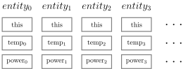

> ## Learning Objectives {.objectives}
>
> * Structuring objects is useful, but has implications on the memory layout of objects
> * Memory layout can be important in performance critical sections of your code 
> * Prefer Structure-of-Arrays over Array-of-Structures

Lola has been approached by the head of the institute. He heard that she is the new helping hand in the IT department. He has a special mission for her: he wants to put up a large screen in the foyer of the IoT that shows the current status of all network devices (smart phones, wearables, VR goggles, ...) that are currently operated in the building. He tells Lola that she doesn't need to worry about the looks of it, she just has to render some numbers in specific fields on the screen in the foyer. There is only one thing, she needs to pay attention to (besides the correctness of the numbers), the upates should be performed so that no delay is visible, aka very fast.

After the institute head leaves, Lola remembers that she saw portions of the code that dealt collecting information of all devices and preparing the data for rendering. She decides to go from there.

```
 struct device_t {

    int temperature_kelvin;
    
    int network_protocol;
    int network_address ;
    int mac_address     ;

    float power_consumption;

    //...
 };
 ```

The `iot::device_t` is the one that comes to mind first. This is an abstraction used to encapsulate the network credentials of a device, the temperature of it (some low-priced chips can become very hot) and the power it currently consumes. After all, the IoT claims that it is very energy efficient. The `iot::device_info` is a vector of `iot::device_t` that are currently active. So Lola starts to explore the API by dedicated tests.

```

TEST_F(iot_setup, runtime_original) {

  const auto current_devices = iot::device_info;

   EXPECT_LE(iot::size(),8*16);

}

```

The test runs through and Lola is happy to have overcome the first obstacle of getting access to the data. Her predecessors has setup a layered data model for her. On top, the `render_entity` resides that offers any client code light-weight access to the data beneath.

```
struct render_entity {

    temperature_view temp;
    power_view pow;
    
    render_entity():
      temp(0),
      pow(0)
    {
      
    }
    
    render_entity(const device_t& _dev):
      temp(_dev.temperature_kelvin),
      pow(_dev.power_consumption)
    {
      
    }

    temperature_view const * temperature() const {
      return &temp;
    }

    power_view const * power() const {
      return &pow;
    }

  };
```

This structure appeals to Lola as the individual logical components of the data are separated and can be dealt with independently. The `view` objects themselves are not very complicated either:

```
struct temperature_view {

    int value;
    std::string html_start;
    std::string val;
    std::string html_end;

    temperature_view(int _data):
      value(_data),
      html_start("<em>"),
      val(std::to_string(_data)),
      html_end(" K</em>"){}

    int prepare() const {

      return val.size();
      }

	//...
  };
  ```
  
  Instances of `temperature_view` ingest the data and prepare the visualisation by means of a string. Lola notices that this is not exactly what she would call a view, but so be it for now. The task at hand is straight forward now:
  
```
TEST_F(iot_setup, runtime_original) {

  std::vector<iot::render_entity> current_devices;
  current_devices.reserve(iot::size());

  for( const iot::device_t& d : iot::device_info )
    current_devices.push_back(iot::render_entity(d));

  std::size_t tmp_size = 0;
  std::size_t pow_size = 0;
  
  for(int r = 0;r<repeats;++r){
    for( const iot::render_entity& e : current_devices )
      tmp_size += e.temperature()->prepare();

    for( const iot::render_entity& e : current_devices )
      pow_size += e.power()->prepare();
  }
  
  EXPECT_GT(pow_size,0.);
  EXPECT_GT(tmp_size,0.);
}
```

When running the code on a subsample of the building, she is surprised to find out that the code takes quite long:

``` {.output}
[ RUN      ] iot_setup.runtime_original
[       OK ] iot_setup.runtime_original (20369 ms)

```

20 seconds for 10 iterations. That is 2 Hz and very very bad given that the monitor in the foyer refreshes at 60 Hz. 

> ## Always measure {.callout}
>
> In order to identify the reasons for performance degradation, tools to measure the performace should be used. Many people try to optimize code based on mere assumptions rather than measurements, which is a very tricky road to go down to. The reasons behind this is, that not only the computer architecture that you are running on is complex, also the compiler is a very advanced and tricky beast.
>
> One very common tool on many Linux machines, is the perf application that was originally developed at CERN. perf offers a terminal based GUI to explore the line-profile it can record or it offers to simply collect statistics of a given jobs and print them. This is, what we'll do:
>
> ```
> $ stat -e LLC-load-misses,LLC-loads ./test_runtime_device_display --gtest_filter=iot_setup.runtime_original
> Performance counter stats for './test_runtime_device_display --gtest_filter=iot_setup.runtime_original':
> ```
> 76.668.366.153      cycles                                                      
>       345.559.773      LLC-load-misses           #   94,08% of all LL-cache hits   
>       367.322.183      LLC-loads                                                   
>
>      21,398600480 seconds time elapsed
> ```
> Wow, 94% percent of all load instructions where data is fetched from RAM into L3 end up being misses (i.e. do not contain the data that is needed by the CPU) and thus need to be reloaded again. 

Lola looks again at the code. The problem that she sees is that the current setup with the `render_entity` object encapsulating different views is not very memory friendly given that each loop only traverses a minor part of it.


As this pattern called "Array of Structures" can be found very regularly in object oriented code bases. Going through the loop that calculates `tmp_size`, the conceptual flow of operations here would be:

1. `entity_0`
2. this pointer of `entity_0` (in order to call the `render_entity::temperature` method)
3. value `entity_0->temp_0`
4. calculate `tmp_size`
5. jump to `entity_1` and repeats

The problem here is often imposed by the long jump from `entity_0` to `entity_1` which must necessarily be `sizeof(temperature_view)+sizeof(power_view)+sizeof(this)`. As we saw in the profiling output, this slows down the application considerably as it would inflict a lot of cache misses.

A solution to the problem is to refactor the code into a "Structure of Arrays".



Here, the calculation of `tmp_size` would involve no jumps at all, as the individual temperature values lie next to eachother in memory, i.e. they are contiguous in memory. Lola does hence convert her code accordingly:

```
TEST_F(iot_setup, runtime_opt) {

  std::vector<int> current_power_width;
  current_power_width.reserve(iot::size());
  std::vector<int> current_temp_width;
  current_temp_width.reserve(iot::size());

  for( const iot::device_t& d : iot::device_info ){
    current_power_width.push_back(std::to_string(d.power_consumption).size());
    current_temp_width.push_back(std::to_string(d.temperature_kelvin).size());
	}

  std::size_t tmp_size = 0;
  std::size_t pow_size = 0;

  for(int r = 0;r<repeats;++r){
    for( size_t i = 0;i<iot::size();++i )
      pow_size += current_power_width[i];

    for( size_t i = 0;i<iot::size();++i )
      tmp_size += current_temp_width[i];
  }

  EXPECT_GT(pow_size,0.);
  EXPECT_GT(tmp_size,0.);
  
}
```

Wehn lola inserts time measurements, she discovers the immense speed-up that she achieve: The original code took 9s for 10 iterations whereas her current code only requires 0.00001s! The reason for this incredible boost are many fold, but are mainly due to the reorganisation of data structures.

> ## Continue to design for Lola {.challenge}
>
> Take the unit tests that were created during this lesson. Rewrite the render_entity class (or define a client class called render_entity_system) so that is becomes a structure of arrays. Measure again! Discuss with a colleaque what the change in design brought in terms of flexibility, testability and runtime. Which version would you choose?
