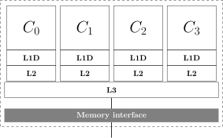

> ## Learning Objectives {.objectives}
>
> * Plain threads in C++11 and beyond 
> * Perform simple vector addition
> * Understand pros/cons of explicit multi-threading

Lola is still working on the realtime monitoring of all devices at the Institute of Things (IoT), so that information about their power consumption, temperature and network connectivity can be displayed on a screen in the foyer of the institute. She is thinking about computing the difference between a series of `device_t` objects at every time step that this information is required. This way visitors have a visual indication what is going on.

While discussing her task with a colleaque, he suggests to consider computing the difference between timesteps in parallel. Her colleaque explains that almost all modern CPUs come with an independet set of compute cores that can work on data concurrently. As the `device_t` objects are independent of each other, this is an emberassingly parallel problem.

He draws a small sketch on the board to illustrate.



Lola's friend explains that each silicon die is separated into distinct compartments. As in the figure above, there are 4 cores that have access to two levels of cache each. Yet another level of memory cache is available that spans all four cores. If more data than fits into L3 is needed, the computer's memory banks are used to load it through the memory interface controller. He continues to explain, that Lola could slice her data into 4 distinct chunks of data.


For example, say we have 16 `device_t` objects and 4 threads available. We should keep the data for each individual thread together, so that the caches for each core can be exploited. Therefor, each thread will process 4 items and write the results to a dedicated array again.
Lola is still a bit sceptical if that all will work out. In the end, she is not very familiar with the concept of multi-threading and decides to play it safe.

```
TEST(power_total,diff_serial) {

  std::vector<device_t> initial_device_info = iot::device_info;
  std::vector<device_t> delta(iot::size());
  iot::update_device_info(device_info);
  std::vector<device_t> updated_device_info = iot::device_info;
    
  for(int i = 0;i<repeats;++i){
    std::transform(initial_device_info.begin(),
    		   initial_device_info.end(),
    		   device_info.begin(),
    		   delta.begin(),
    		   std::minus<iot::device_t>()
    		   );
  }

  for(size_t i = 0;i<20;++i)
    EXPECT_NE(delta[i].power_consumption,0);
}

```

She decides to start validating her results only on a subset of the data, aka 20 items, so that her tests don't take that long. Going on from here, she takes the same test setup:

```
TEST(power_total,diff_parallel) {

  std::vector<device_t> initial_device_info = iot::device_info;
  std::vector<device_t> delta(iot::size());
  iot::update_device_info(device_info);
  std::vector<device_t> updated_device_info = iot::device_info;
  
```

Then she decides to wrap the parallel operation into a function for now.

```
TEST(power_total,diff_parallel) {

//setup!

	for(int i = 0;i<repeats;++i){
		parallel_difference(initial_device_info,updated_device_info,delta);
	}
		
	for(size_t i = 0;i<20;++i)
		EXPECT_NE(delta[i].power_consumption,0);
}
```

In order to start, she sets up the function `parallel_difference`, but leaves it empty for now, so that her tests fail.

```
void parallel_difference(const std::vector<device_t>& _lhs,
			 const std::vector<device_t>& _rhs,
			 std::vector<device_t>&_result){

  if(_result.size()!=_rhs.size() || _result.empty())
    _result.resize(_rhs.size());

}

```

Once that is done, she can start implementing the parallel version. She has to read up the [documentation of `std::thread`](http://en.cppreference.com/w/cpp/thread/thread/thread) again to get a head start. At first, she adds the boiler plate to construct the thread objects.

```
void parallel_difference(const std::vector<device_t>& _lhs,
			 const std::vector<device_t>& _rhs,
			 std::vector<device_t>&_result){

  if(_result.size()!=_rhs.size() || _result.empty())
    _result.resize(_rhs.size());

  std::vector<std::thread> workers;

  for(auto& w : workers)
    w.join();
}

```

Tests still fail, because she didn't actually construct any threads that could be joined together. One has to note, that as soon as a thread is constructed it starts to run. The `join` method is some form of a barrier, i.e. the main thread from which join is called will wait until the thread that called join has finished. So in essence, the last loop above is simply saying "stop here until all threads have finished".

Now we have to provide the thread with some work to do. Lola wants to make her life easy for now, and not deal with class or structs yet. She decides to write another function that given a thread ID will compute the difference only on a sub-compartment of the data.

```
TEST(power_total,diff_in_thread) {

  std::vector<device_t> initial_device_info = iot::device_info;
  std::vector<device_t> delta(iot::size());
  iot::update_device_info(device_info);
  std::vector<device_t> updated_device_info = iot::device_info;
  
  diff_in_thread(initial_device_info,updated_device_info,
		 delta, 0);

  EXPECT_NE(delta.front().power_consumption,0);
  EXPECT_LT(delta.back().power_consumption,1e-3);
  EXPECT_FLOAT_EQ(delta.front().power_consumption,initial_device_info.front().power_consumption);
  EXPECT_NE(delta.back().power_consumption,initial_device_info.back().power_consumption);
}

void diff_in_thread(const std::vector<device_t>& _lhs,
		    const std::vector<device_t>& _rhs,
		    std::vector<device_t>&_result,
		    size_t thread_id){

  const size_t items_per_thread = (_lhs.size() + std::thread::hardware_concurrency() - 1)/std::thread::hardware_concurrency();
  const size_t offset = thread_id*items_per_thread;

  for(size_t offset = thread_id*items_per_thread;
      offset<((thread_id+1)*items_per_thread);
      ++offset)
    {
      _result[offset] = _lhs[offset] - _rhs[offset];
    }
  
}
```

After she makes the test `power_total.diff_in_thread` compile and run without errors, she looks at her implementation. To be honest, the way `diff_in_thread` is implemented seems pretty inflexible. Instead of handing over only parts of the input array, she always hands in a reference to the entire array. One could think about making this function more flexible, by accepting pointer ranges or iterators only. This would make it more testable as well, as we have the magic `0` in the test call now. But Lola decides (not without a bad feeling) to leave this refactoring aside for now as she wants to see the full power of parallelisation in action.

She needs to continue in extending `parallel_difference`:

```
void parallel_difference(const std::vector<device_t>& _lhs,
			 const std::vector<device_t>& _rhs,
			 std::vector<device_t>&_result){

  if(_result.size()!=_rhs.size() || _result.empty())
    _result.resize(_rhs.size());
  
  std::vector<std::thread> workers;
  
  for(size_t tid = 0;tid<std::thread::hardware_concurrency();++tid){
    workers.push_back(std::thread(diff_in_thread,
				                  std::ref(_lhs),
				                  std::ref(_rhs),
				                  std::ref(_result),
				                  tid
				                 )
		      );
  }

  for(auto& w : workers)
    w.join();
    
}
```

Her tests all pass now and she is awed by the fact that the runtime of the serial version is cut in half on her laptop with 2 physical cores. That is as much as she wants.

Lola is very enthusiastic now as the server that will compute this difference has 32 cores in total. That will make much easier now. She wants to tackle a different problem now. One of the operations she does all the time, is summing up the power consumption of all devices. She subsequently wants to prototype this operation and potentially use it later in her code.


```
TEST(lockless_sum,simple_sum) {

  float sum = 0;
  std::vector<float> some_values(1e5,42);
  std::vector<std::thread> workers;

  for(int r = 0;r<repeats;++r){
    for(size_t tid = 0;tid<std::thread::hardware_concurrency();++tid){
      workers.push_back(std::thread(add_up,
				    std::ref(some_values),
				    tid,
				    std::ref(sum)
				    )
			);
    }
    
    for(auto& w : workers)
      w.join();
    
    workers.clear();
    ASSERT_FLOAT_EQ(sum,some_values.size()*42.);
    sum = 0;
  }
  
}
```

The actual summation looks like this:

```
void add_up(const std::vector<float>& _data,
	    size_t _thread_id,
	    float& _sum){

  const size_t items_per_thread = (_data.size() + std::thread::hardware_concurrency() - 1)/std::thread::hardware_concurrency();
  const size_t offset = _thread_id*items_per_thread;

  for(size_t offset = _thread_id*items_per_thread;
      offset<((_thread_id+1)*items_per_thread);
      ++offset)
    {
      _sum += _data[offset];
    }
}
```

Something is wrong here, the test didn't produce the output Lola expected. Moreover, the result is quite off. Further, the outcome of the test changes from invocation to invocation.

The code that Lola just ran introduced a data race very similar to what you'll get if you use `std::cout` from multiple-threads at the same time without taking care. The problem is that the reference to `sum` is shared among threads. Why is this a problem? Let's decipher what is going in the following statement:

```
_sum += _data[offset];
```

This operation is conceptually doing the following:

1. load `_data[offset]`
1. load `_sum`
1. add `_data[offset]` and `_sum`
1. write new value of `_sum` to memory

The proble is that we have n threads that perform this task. In the above implementation, the operating system will allow any thread to have access to `_sum` at any point in time. The problem is, that updates to _sum first happend within the thread only and are then written to memory. With this, any thread can load `_sum` but while he is loading it, any other thread might write to it. When our initial thread then tries to update `_sum`, it effectively skips all work that any other thread has done in the meantime. This problem is called a data race!

The issue can be resolved by forcing the threads to perform any read or writes in a synchronized fashion. There are mostly two ways that C++11 offers: using mutex locks or atomics. For this example, we choose the latter. As it does not use mutex locks, this approach is called lockless programming.

```
void lockless_add_up(const std::vector<float>& _data,
		     size_t _thread_id,
		     std::atomic<float>& _sum){

  const size_t items_per_thread = (_data.size() + std::thread::hardware_concurrency() - 1)/std::thread::hardware_concurrency();
  const size_t offset = _thread_id*items_per_thread;

  const size_t chunk_begin = _thread_id*items_per_thread;
  size_t chunk_end = (_thread_id+1)*items_per_thread;
  if(chunk_end>_data.size())
    chunk_end = _data.size();

  float partial_sum = 0;
  for(size_t offset = chunk_begin;offset<chunk_end;++offset)
    {
      partial_sum = partial_sum + _data[offset];
    }

  _sum = _sum + partial_sum;
}
  
TEST(lockless_sum,correct) {

  std::atomic<float> sum(0);
  std::vector<float> some_values(1e5,42);
  std::vector<std::thread> workers;

  for(int r = 0;r<repeats;++r){
    for(size_t tid = 0;tid<std::thread::hardware_concurrency();++tid){
      workers.push_back(std::thread(lockless_add_up,
				    std::ref(some_values),
				    tid,
				    std::ref(sum)
				    )
			);
    }
  
}
```

We fall back to computing a partial sum per thread, so that there are less access to the `std::atomic<float>`. Lola is happy to see her code running now correctly and moves on to deploy this function whereever needed.

This chapter introduced you to explicit multi-threading, i.e. you have to construct threads on your own and make sure they work in an orchestrated fashion. The C++11 (and later) standard will help you with this, but as long as you are using `std::thread` you have to care a lot about how the threads interact. In practice, `std::thread` is used heavily in some domains (think GUI vendors) and very rarely in others (think scientific computing and simulation). if you can, *do not start* writing an implementation with `std::thread` right away. Try to use implicit multi-threading first.


> ## Probe your Metal {.challenge}
>
> Take the time and find out:
>
> 1. How many physical cores does your laptop/workstation have?
> 2. How many logical cores does your laptop/workstation have?
>
> Share your results in the Etherpad and research what the difference is!

> ## The free lunch is over {.challenge}
>
> Herb Sutter (Microsoft) once coined the phrase "The free lunch is over!" ([2005](http://www.gotw.ca/publications/concurrency-ddj.htm)) referring to the end of an era where software companies would simply wait for new hardware to be purchased and not bother with accelerating code.
>
> Look at the applications that you use every day in your computer. Do they use multiple threads? If no, why wouldn't they?

> ## Parallel Printing {.challenge}
>
> Use the implementation of `parallel_difference` and write a function that simply prints the current thread ID to stdout! What are your observations if you run the test several times.


> ## Always measure! {.challenge}
>
> When things become performance critical, one should always expose a healthy scepticism towards a gut feeling on how fast/slow an algorithm will run. Take the contents of `iot::device_info` and compute the sum of all devices power consumption. Compare the runtime to a serial implementation.
